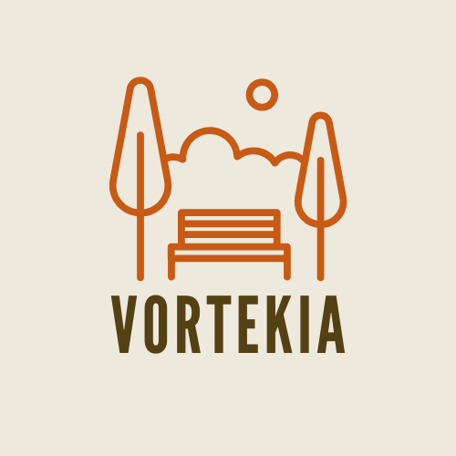

<h1 align="center"> VorteKia 🎡⛲ </h1>

<p align="center">
  
</p>

<p align="center">
  Amusement Park World Desktop App — Built with Tauri, Rust, React, and more.
</p>

---

# VorteKia: Amusement Park Desktop App 🎡🖥️

VorteKia is a cross-platform desktop application developed using **Tauri**, **Rust**, **React**, **Vite**, **Tailwind CSS**, and **Three.js**. It serves as an interactive amusement park management system with features for customer interactions, souvenir purchases, and immersive 3D visuals.

---

## 🧭 Table of Contents

1. [Project Overview](#project-overview)
2. [Mockup Screenshot](#mockup-screenshot)
3. [Technology Stack](#technology-stack)
4. [Prerequisites](#prerequisites)
5. [How to Run Locally](#how-to-run-locally)
6. [Database & Caching Setup](#database--caching-setup)

---

## 📌 Project Overview

- **Name**: VorteKia
- **Type**: Desktop Application
- **Purpose**: Built for TPA Lab Assistant @ BINUS University
- **Focus**: Local amusement park simulation, souvenir store, and customer interaction platform.
- **Lore**: Here's the full lore of how VorteKia is!
   <p align="center">
      
   </p>

---

## 📸 Mockup Screenshot

**Coming Soon**

---

## ⚙️ Technology Stack

### 💻 Core Technologies

- **Rust** — Backend logic & Tauri bridge
- **Tauri** — Lightweight desktop application runtime
- **React (w/ Vite)** — Frontend UI
- **Tailwind CSS** — Styling
- **Three.js** — 3D park visualization

### 🗃️ Data & Infrastructure

- **PostgreSQL** — Primary database
- **Redis** — Local cache layer
- **SeaORM** — ORM for Rust

---

## ✅ Prerequisites

Make sure these tools are installed:

- [Node.js](https://nodejs.org/)
- [Rust](https://www.rust-lang.org/tools/install)
- [Tauri CLI](https://tauri.app/v1/guides/getting-started/prerequisites)
- [Vite](https://vitejs.dev/)
- [Docker Desktop](https://www.docker.com/) _(optional for Redis & PostgreSQL)_
- WSL (for Redis on Windows)

---

## 🚀 How to Run Locally

### 1. Clone the Repository

```bash
git clone https://github.com/yourusername/vortekia.git
cd vortekia
```

### 2. Install Dependencies

```bash
npm install
```

### 3. Run the App in Dev Mode

```bash
npm run tauri dev
```

---

## 🗄️ Database & Caching Setup

### PostgreSQL with SeaORM

1. Navigate to Tauri backend:

   ```bash
   cd src-tauri
   ```

2. Run migrations:

   ```bash
   sea-orm-cli migrate up
   ```

   Or for fresh start:

   ```bash
   sea-orm-cli migrate fresh
   ```

3. Generate entities:

   ```bash
   sea-orm-cli generate entity -o entity/src/
   ```

---

### Redis (Run via WSL if on Windows)

1. Launch WSL:

   ```bash
   wsl
   ```

2. Start Redis server:

   ```bash
   sudo service redis-server start
   ```

3. Test Redis CLI:

   ```bash
   redis-cli
   ```

   Should return:

   ```bash
   127.0.0.1:6379> ping
   PONG
   ```

---

## 📬 Contact / Issues

Feel free to open issues or contact me if you need help setting it up!

---

> Made with 💙 for the BINUS Lab Assistant TPA Final Project.
